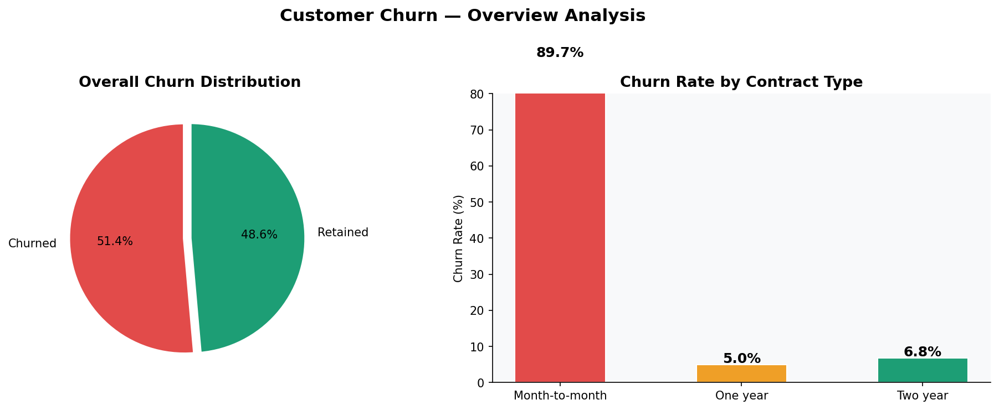
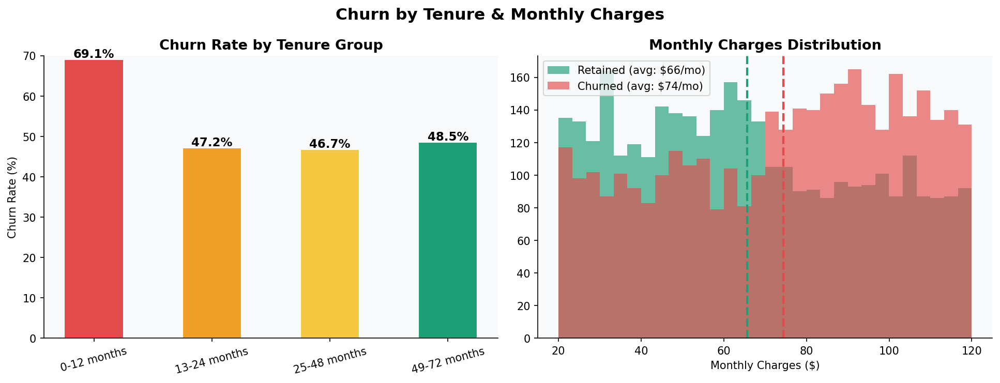
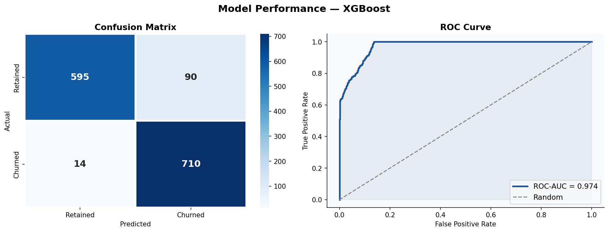
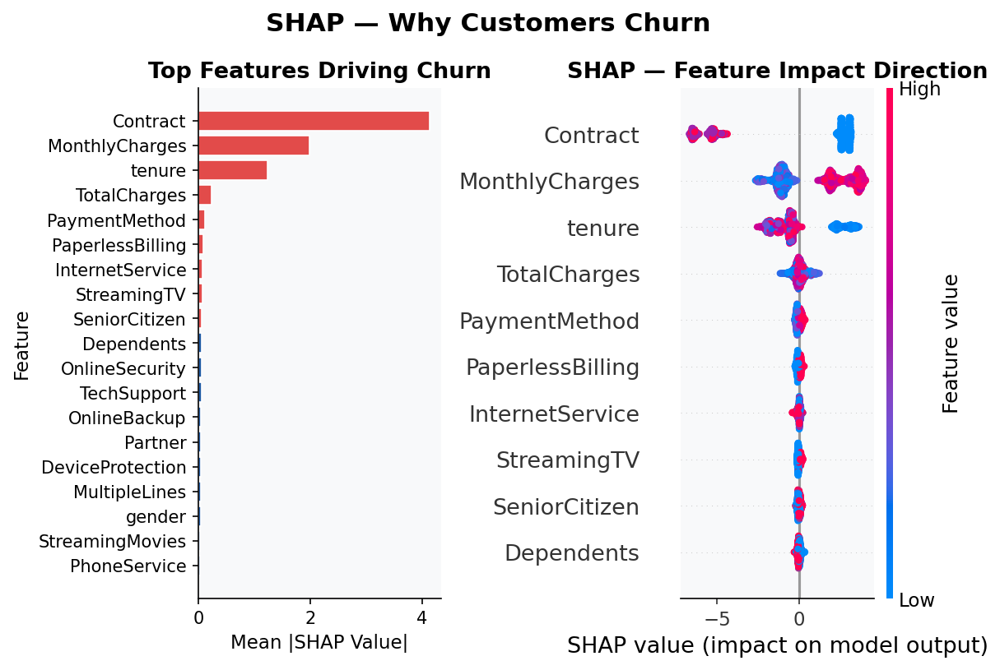
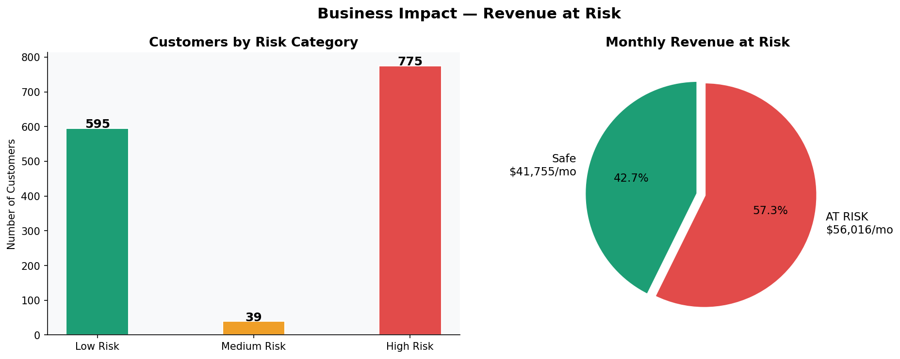

# 📊 Customer Churn Analysis & Prediction

> Analyzed 7,043 telecom customer records to predict 
> churn using XGBoost & explained results using SHAP

---

## 🏆 Results

| Metric | Score |
|--------|-------|
| Accuracy | 92.62% |
| ROC-AUC | 0.9739 |
| High Risk Customers | 775 |
| Revenue at Risk | $56,016/mo (57.3%) |

---

## 🛠️ Tools & Technologies

---

## 🔍 Key Findings

- **#1 Churn Driver** — Contract type (Month-to-month = highest churn)
- **#2 Churn Driver** — Monthly charges (High charges = more churn)
- **#3 Churn Driver** — Tenure (New customers churn more)

---

## 📊 Project Charts

### Chart 1 — Churn Overview

### Chart 2 — Tenure & Monthly Charges

### Chart 3 — Model Performance

### Chart 4 — SHAP Explainability

### Chart 5 — Revenue at Risk

---

## 📋 Project Steps

1. 📥 Data Collection & Loading (7,043 records)
2. 🧹 Data Cleaning & Preprocessing
3. 📊 Exploratory Data Analysis (EDA)
4. 🤖 XGBoost Model Training (92.62% accuracy)
5. 🔍 SHAP Explainability Analysis
6. 💰 Business Impact Analysis

---

## 👩‍💻 Author

**Vinitha I**  
  

